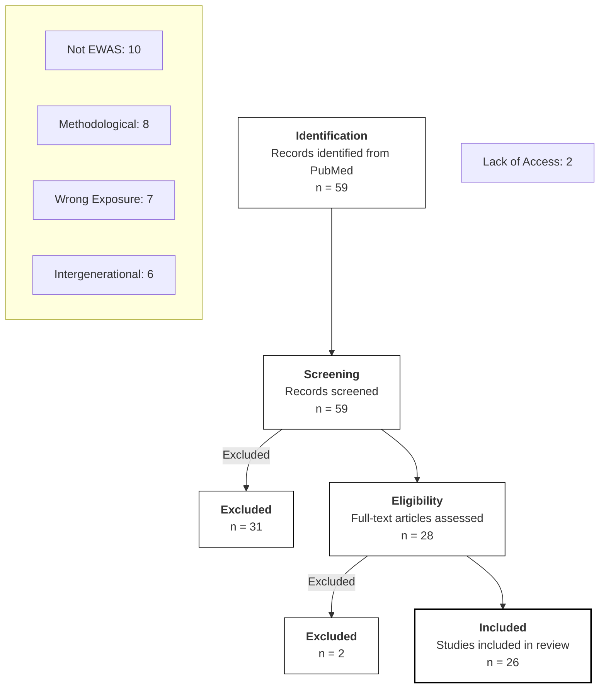

# Screening Process

## Query

The following search query was used to identify relevant records in PubMed on 1/9/2026:

```C
(
  (
    "EWAS"[Title/Abstract]
    OR "epigenome-wide"[Title/Abstract]
    OR "epigenome wide"[Title/Abstract]
    OR "genome-wide methylation"[Title/Abstract]
    OR "methylation array"[Title/Abstract]
    OR "450k"[Title/Abstract]
    OR "HumanMethylation450"[Title/Abstract]
    OR "EPIC array"[Title/Abstract]
    OR "MethylationEPIC"[Title/Abstract]
    OR "850k"[Title/Abstract]
    OR "Infinium"[Title/Abstract]
  )
  AND
  (
    "Adverse Childhood Experiences"[MeSH]
    OR "Child Abuse"[MeSH]
    OR "child abuse"[Title/Abstract]
    OR "child maltreatment"[Title/Abstract]
    OR "childhood trauma"[Title/Abstract]
    OR "traumatic childhood experiences"[Title/Abstract]
    OR "early life stress"[Title/Abstract]
    OR "early-life stress"[Title/Abstract]
    OR "early life adversity"[Title/Abstract]
    OR "childhood adversity"[Title/Abstract]
    OR "adverse childhood experience"[Title/Abstract]
    OR "adverse childhood experiences"[Title/Abstract]
    OR "early abuse experiences"[Title/Abstract]
    OR "adolescent trauma"[Title/Abstract]
  )
)
AND humans[Filter]
NOT (
  review[Publication Type]
  OR editorial[Publication Type]
  OR comment[Publication Type]
  OR letter[Publication Type]
)
```

Journals were screened based on the population and methodology available in their abstracts; if criteria were unclear, I tried my best to determine eligibility from deeper dive into their introduction and methods sections (when available)

## Screening



## Summary

### Included Studies (n = 26)

| PMID | Title | Full Text |
| :--- | :--- | :--- |
| 41504111 | Inter-individual differentially methylated region-targeted EWAS reveals epigenetic signatures of early childhood adversity | Open Access |
| 40057810 | Maternal epigenetic index links early neglect to later neglectful care and other psychopathological, cognitive, and bonding effects | Open Access |
| 35395780 | Epigenetics of early-life adversity in youth: cross-sectional and longitudinal associations | Open Access |
| 23332324 | Child abuse and epigenetic mechanisms of disease risk | Open Access |
| 27643477 | Epigenetic signatures of childhood abuse and neglect: Implications for psychiatric vulnerability | Open Access |
| 35501310 | An epigenetic association analysis of childhood trauma in psychosis reveals possible overlap with methylation changes associated with PTSD | Open Access |
| 36012217 | Experiences of Trauma and DNA Methylation Profiles among African American Mothers and Children | Open Access |
| 24618023 | Childhood abuse is associated with methylation of multiple loci in adult DNA | Open Access |
| 24655651 | Child abuse, the oxytocin receptor gene, and epigenetic risk for depression | Open Access |
| 25612291 | Borderline personality disorder and childhood maltreatment: a genome-wide methylation analysis | Open Access |
| 26847422 | Methylation of the glucocorticoid receptor gene (NR3C1) in saliva samples of maltreated children | Open Access |
| 28241754 | DNA methylation profiles of elderly individuals subjected to indentured childhood labor and trauma | Open Access |
| 29258561 | Childhood maltreatment is associated with DNA methylation of the glucocorticoid receptor gene (NR3C1) in peripheral blood of psychiatric patients | Open Access |
| 29325449 | DNA methylation of the oxytocin receptor gene (OXTR) is associated with childhood maltreatment and depression in a female sample | Open Access |
| 29795411 | Genome-wide DNA methylation study of childhood abuse and adult mental health outcomes | Open Access |
| 29888956 | Epigenetic signatures of childhood adversity in the 1958 British Birth Cohort | Open Access |
| 30279435 | Childhood trauma and DNA methylation of the FKBP5 gene in patients with borderline personality disorder | Open Access |
| 30510187 | Childhood maltreatment and DNA methylation of the serotonin transporter gene (SLC6A4) in adults with major depression | Open Access |
| 30905381 | Epigenome-wide association study of childhood adversity and DNA methylation in the ALSPAC and NSHD cohorts | Open Access |
| 32203862 | Childhood adversity and DNA methylation of stress-related genes in a community sample of young adults | Open Access |
| 33414392 | A genome-wide methylation study reveals X chromosome and childhood trauma methylation alterations associated with borderline personality disorder | Open Access |
| 33542190 | Epigenetic age acceleration in adults exposed to childhood adversity | Open Access |
| 34600028 | Childhood trauma and DNA methylation of the GR gene in a sample of psychiatric patients | Open Access |
| 35899434 | DNA methylation of stress-related genes and childhood trauma in a sample of young adults | Open Access |
| 36266402 | Epigenetic impact of a 1-week intensive multimodal group program for adolescents with multiple adverse childhood experiences | Institutional Access |
| 39565630 | War Exposure and DNA Methylation in Syrian Refugee Children and Adolescents | Institutional Access |

### Excluded Studies (n = 33)

| PMID | Title | Reason | Explanation |
| :--- | :--- | :--- | :--- |
| 34333774 | Paternal adverse childhood experiences: Associations with infant DNA methylation | Intergenerational | paternal ACEs assoc w/ offspring DNAm |
| 37845746 | Maternal adverse childhood experiences (ACEs) and DNA methylation of newborns in cord blood | Intergenerational | intergenerational maternal ACEs to child DNAm |
| 31070508 | Prenatal maternal depressive symptoms and infant DNA methylation: a longitudinal epigenome-wide study | Intergenerational | Prenatal maternal stress exposure to offspring outcome |
| 38654405 | Developmental epigenomic effects of maternal financial problems | Intergenerational | exposure parent stressor to offspring |
| 37330044 | Stage 2 Registered Report: Epigenetic Intergenerational Transmission: Mothers' Adverse Childhood Experiences and DNA Methylation | Intergenerational | intergenerational transmission |
| 29026448 | Newborn genome-wide DNA methylation in association with pregnancy anxiety reveals a potential role for GABBR1 | Intergenerational | data measured in infants |
| 37062770 | Exploring the mediation of DNA methylation across the epigenome between childhood adversity and First Episode of Psychosis-findings from the EU-GEI study | Lack of Access | EWAS in FEP and healthy with childhood adversity scales |
| 33215951 | Childhood exposure to hunger: associations with health outcomes in later life and epigenetic markers | Lack of Access | EWAS and ELA; no full-text but results are none |
| 33749330 | Epigenetic age associates with psychosocial stress and resilience in children of Latinx immigrants | Methodological | epigenetic age; and systemic stressors  != ELA |
| 35156895 | Updates to data versions and analytic methods influence the reproducibility of results from epigenome-wide association studies | Methodological | assesses impact of data/analytic versions on ewas replicability using adversity as test case |
| 26351305 | Lymphoblastoid cell lines reveal associations of adult DNA methylation with childhood and current adversity that are distinct from whole blood associations | Methodological | pilot study assessing LCL utility vs whole blood for environmental epigenomics |
| 38820651 | Epigenetic signatures of social anxiety, panic disorders and stress experiences: Insights from genome-wide DNA methylation risk scores | Methodological | secondary analysis calc MRS; no new CpG |
| 41214810 | Impact of psychosocial stress in early life on pace of aging in young adulthood | Methodological | epigenetic age not probe-by-probe EWAS |
| 39051592 | Childhood trauma is linked to epigenetic age deceleration in young adults with previous youth residential care placements | Methodological | epigenetic age not probe-by-probe EWAS |
| 38407202 | DNA methylation-environment interactions in the human genome | Methodological | exposure is dexamethosone and IF-alpha; not cohort EWAS |
| 38417921 | Epigenetic studies in children at risk of stunting and their parents in India, Indonesia and Senegal: a UKRI GCRF Action Against Stunting Hub protocol paper | Methodological | data captured in patients from infancy |
| 38467473 | The interaction between polygenic risk score and trauma affects the likelihood of post-traumatic stress disorder in female victims of sexual assault | Not EWAS | genotyping/PRS study, not EWAS |
| 31122292 | Identification of dynamic glucocorticoid-induced methylation changes at the FKBP5 locus | Not EWAS | targeted analysis of FKBP5 locus dynamics following dexamethasone challenge |
| 29781947 | Childhood Trauma, DNA Methylation of Stress-Related Genes, and Depression: Findings From Two Monozygotic Twin Studies | Not EWAS | candidate gene study (5 genes) on childhood trauma |
| 31683097 | Investigation of MORC1 DNA methylation as biomarker of early life stress and depressive symptoms | Not EWAS | candidate gene study targeting MORC1, not EWAS |
| 34424394 | Associations of age, sex, sexual abuse, and genotype with monoamine oxidase a gene methylation | Not EWAS | candidate gene study (MAOA), not EWAS |
| 23799031 | Profiling of childhood adversity-associated DNA methylation changes in alcoholic patients and healthy controls | Not EWAS | Candidate gene study (384 CpGs, 82 genes), not EWAS |
| 29028111 | DNA methylation of methylation complex genes in relation to stress and genome-wide methylation in mother-newborn dyads | Not EWAS | candidate gene study investigating 10 specific genes and global mean methylation, not site-specific EWAS; maternal stress exposure |
| 40753956 | Examining the timing of trauma, PTSD onset, and DNA methylation: A multicohort investigation of candidate CpG sites | Not EWAS | targeted analysis of 3 specific CpGs, not EWAS |
| 27323309 | Methylation of the oxytocin receptor gene mediates the effect of adversity on negative schemas and depression | Not EWAS | candidate gene study (OXTR), not EWAS |
| 35914392 | Examining the epigenetic mechanisms of childhood adversity and sensitive periods: A gene set-based approach | Not EWAS | not genome-wide discovery analysis |
| 41093898 | Salivary DNA methylation and pubertal development in adolescents | Wrong Exposure | EWAS of puberty/development, maltreatment only implication |
| 38362742 | DNA methylation changes in association with trauma-focused psychotherapy efficacy in treatment-resistant depression patients: a prospective longitudinal study | Wrong Exposure | investigates psychotherapy treatment effects, not direct adversity association |
| 39016098 | A novel hypothesis-generating approach for detecting phenotypic associations using epigenetic data | Wrong Exposure | EWAS on dysmenorrhea/HMB; ACEs associated with conditions in secondary analysis |
| 35089926 | The methylome in females with adolescent Conduct Disorder: Neural pathomechanisms and environmental risk factors | Wrong Exposure | exposure is CD not specifically ELA/ACE etc |
| 40394752 | Maternal birth experience and DNA methylation | Wrong Exposure | exposure is perinatal factor not child maltreatment |
| 30770782 | Establishing a generalized polyepigenetic biomarker for tobacco smoking | Wrong Exposure | exposure is smoking |
| 28319850 | Methylation of HPA axis related genes in men with hypersexual disorder | Wrong Exposure | exposure is hypersexual disorder |
